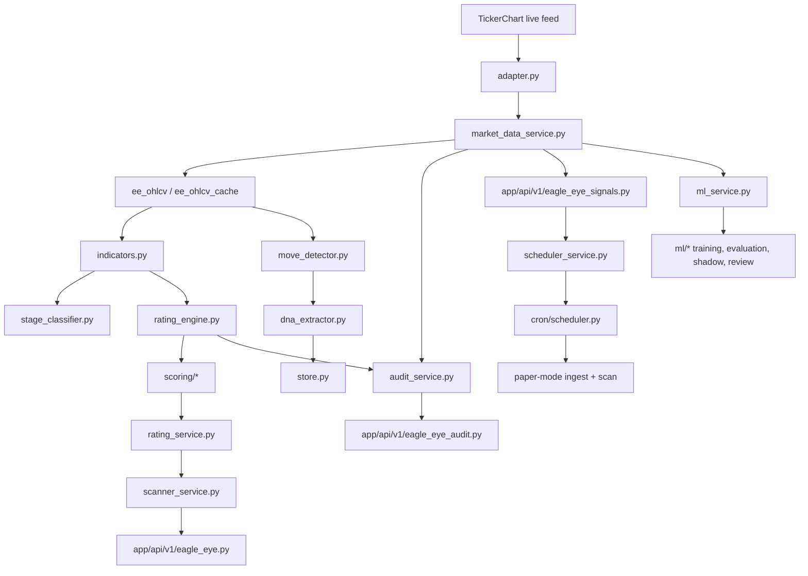

# Eagle Eye Audit 1.0

Date: 2026-07-09
Scope: `app/services/eagle_eye`, related Eagle Eye API routers, and the scheduler hooks that invoke the module.

## Executive Summary

Eagle Eye is a mixed rules-plus-ML Kuwait stock analysis system built around three layers:

1. Live and cached market data acquisition from TickerChart and legacy OHLCV cache tables.
2. Rules-first lifecycle scoring, phase classification, rating generation, signal logging, and scan APIs.
3. A separate ML workstream for labeling, feature generation, calibration, walk-forward evaluation, shadow scoring, auto-disable monitoring, and weekly review.

Current audit verdicts:

- TickerChart candles are ingested as raw candles; there is no active split/bonus/dividend adjustment engine in Eagle Eye today.
- `value` is native when present in the TickerChart daily bar feed; `turnover_kwd` falls back to `close * volume` only when the feed omits `value`.
- The module has multi-year backfill coverage in practice; the current live feed and canonical DB both support multi-year history.
- The current data-quality quarantine layer is active and can block symbols from the canonical pipeline.
- The existing scanner remains rules-first; ML is mainly used for labeling, feature pipelines, shadow runs, and optional gating.

## Runtime Map

## Core Module Inventory

### Data access and storage

- [adapter.py](app/services/eagle_eye/adapter.py) - wraps TickerChart access, converts live rows to DataFrames, computes `turnover_kwd`, provides fallback symbol mapping, and exposes a synthetic test adapter.
- [market_data_service.py](app/services/eagle_eye/market_data_service.py) - canonical ingestion and configuration hub; manages `ee_ohlcv`, engine config, data-quality quarantine, audit events, and the current TickerChart ingest path.
- [store.py](app/services/eagle_eye/store.py) - legacy persistent store for `ee_ohlcv_cache`, `ee_dna_profiles`, `ee_ratings_cache`, `ratings_history`, and `ee_compute_log`.
- [ingest.py](app/services/eagle_eye/ingest.py) - legacy OHLCV ingest and nightly recompute path; still exists beside the canonical v2 pipeline.
- [config.py](app/services/eagle_eye/config.py) - Eagle Eye runtime configuration constants and thresholds.

### Market analysis and lifecycle logic

- [indicators.py](app/services/eagle_eye/indicators.py) - indicator computation layer used by DNA, ratings, and scanner logic.
- [indicator_service.py](app/services/eagle_eye/indicator_service.py) - persists indicator payloads and reads latest indicator state.
- [move_detector.py](app/services/eagle_eye/move_detector.py) - detects price moves and fakeouts used by DNA and event recording.
- [dna_extractor.py](app/services/eagle_eye/dna_extractor.py) - builds behavioral DNA from recorded events and indicator context.
- [recorder.py](app/services/eagle_eye/recorder.py) - converts detected events into normalized event snapshots for DNA extraction.
- [stage_classifier.py](app/services/eagle_eye/stage_classifier.py) - maps indicator state and family scores to lifecycle stage labels.
- [risk_service.py](app/services/eagle_eye/risk_service.py) - liquidity and risk filters for scoring and entry logic.
- [rating_engine.py](app/services/eagle_eye/rating_engine.py) - computes support/resistance, entry/stop/targets, and volume context.
- [rating_service.py](app/services/eagle_eye/rating_service.py) - stores current ratings and historical rating snapshots.
- [entry_exit_service.py](app/services/eagle_eye/entry_exit_service.py) - entry, exit, and position state logic.
- [pipeline.py](app/services/eagle_eye/pipeline.py) - canonical per-bar processing path used by the scanner and scheduler.
- [scanner_service.py](app/services/eagle_eye/scanner_service.py) - assembles the stock universe and serves scanner-level state.
- [scheduler_service.py](app/services/eagle_eye/scheduler_service.py) - canonical end-of-day run coordination, now skipping quarantined symbols and logging run outcomes.
- [simulator.py](app/services/eagle_eye/simulator.py) - paper-trading simulator integration.
- [backtest_service.py](app/services/eagle_eye/backtest_service.py) - backtesting helpers for historical strategy evaluation.

### Audit and signal surface

- [audit_service.py](app/services/eagle_eye/audit_service.py) - change request lifecycle, audit events, summaries, and allowed transition logic.
- [app/api/v1/eagle_eye_audit.py](app/api/v1/eagle_eye_audit.py) - public audit/change-management router.
- [app/api/v1/eagle_eye_signals.py](app/api/v1/eagle_eye_signals.py) - scan, ratings, state, performance, data-quality, ingest, and pipeline-mode endpoints.
- [app/api/v1/eagle_eye.py](app/api/v1/eagle_eye.py) - main scanner and stock analysis router.

### Scoring layer

- [scoring/family_scores.py](app/services/eagle_eye/scoring/family_scores.py) - family-level score aggregation.
- [scoring/recommendation_engine.py](app/services/eagle_eye/scoring/recommendation_engine.py) - converts score inputs into recommendation buckets and confidence.
- [scoring/explanation_engine.py](app/services/eagle_eye/scoring/explanation_engine.py) - generates user-facing rationale for recommendations.
- [scoring/__init__.py](app/services/eagle_eye/scoring/__init__.py) - exports the scoring API.

## API Surface

### `app/api/v1/eagle_eye.py`

This is the user-facing scanner and stock-analysis router. It serves:

- scanner listings with cached universe assembly.
- single-stock analysis.
- behavioral DNA views.
- historical move event views.
- refresh/recompute actions.
- regime views.

Internally it keeps several in-memory caches for metadata, fundamentals, latest close, volume stats, scanner payloads, and regime state.

### `app/api/v1/eagle_eye_audit.py`

This is the audit and change-management surface. It exposes:

- audit design and allowed transitions.
- audit event creation and listing.
- change request creation, review, lookup, transition, and summary views.

### `app/api/v1/eagle_eye_signals.py`

This router is the operational control plane for Eagle Eye signals. It exposes:

- watchlist and signal views.
- single signal detail.
- ratings history.
- symbol state.
- scan execution.
- scan preview.
- engine config read/update.
- data-quality quarantine list and clear actions.
- TickerChart ingest endpoint.
- pipeline mode update endpoint.
- performance summary.

The R8 work added the ingest, data-quality, and paper-mode controls here.

## Scheduler Surface

### `app/cron/scheduler.py`

The scheduler wires Eagle Eye into the broader app lifecycle. It currently includes:

- legacy nightly recompute jobs.
- intraday refresh and nightly recompute cadence.
- weekly DNA rebuild.
- paper trading simulator.
- the new R8 Sun-Thu 15:30 Asia/Kuwait paper-mode TickerChart ingest + scan job.

The R8 job checks `pipeline_mode == paper` before running.

## Canonical Data Flow

1. TickerChart fetches raw EOD candles from `ondemandDataLoader.php`.
2. `tickerchart_service.py` parses `date, open, high, low, close, volume, value, trades` rows.
3. `adapter.py` converts the rows into `open, high, low, close, volume, turnover_kwd` frames.
4. `market_data_service.py` persists canonical OHLCV into `ee_ohlcv` and raises audit/data-quality events.
5. `indicators.py`, `move_detector.py`, and `dna_extractor.py` transform history into signals and DNA.
6. `rating_engine.py`, `stage_classifier.py`, and `scoring/*` build ratings and recommendations.
7. `scanner_service.py` and `app/api/v1/eagle_eye.py` expose the live board.
8. `audit_service.py` stores change requests and event history.
9. `ml_service.py` and `ml/*` handle labeling, training, shadow runs, calibration, and monitoring.

## TickerChart Findings

### Fetch and auth

- Login/signing is implemented in `tickerchart_service.py`.
- OHLCV fetch is done through `https://<market-host>/tcdata/ondemandDataLoader.php`.
- Retries are bounded and short.

### Bar schema

- Native bar fields include `date`, `open`, `high`, `low`, `close`, `volume`.
- Optional fields include `value` and `trades`.
- `value` is used when present; otherwise the adapter estimates turnover as `close * volume`.

### Adjustment policy

- There is no active corporate-action adjustment engine in Eagle Eye.
- The parser removes phantom rows and de-duplicates by date, but that is not equivalent to split/bonus/dividend back-adjustment.
- This remains the main go-live ambiguity if a future feed change starts returning adjusted candles.

### Backfill depth

- The live ingest path can backfill multi-year history.
- In the R8 run, the requested names backfilled to 2021-01-01 and beyond, which is sufficient for historical statistical checks.

### Universe coverage

- The scanner universe is seeded from `KUWAIT_STOCKS` and enriched from `analysis_stocks`.
- The adapter includes explicit fallback mapping for legacy symbol mismatches such as `BKIKWT -> BKI`.

## Storage Layer

### Legacy cache

- `ee_ohlcv_cache` holds the older cache-backed bar set.
- `ee_dna_profiles` stores per-symbol DNA JSON.
- `ee_ratings_cache` stores current ratings and the current engine metadata.
- `ratings_history` stores point-in-time snapshots.
- `ee_compute_log` stores run logging.

### Canonical v2 storage

- `ee_ohlcv` is the canonical OHLCV table used by the new ingest path.
- `ee_data_quality_quarantine` stores quarantined symbols and reasons.
- `ee_engine_config` and `ee_change_requests` govern change-managed configuration.
- `ee_audit_events` stores audit trail records.

## Data-Quality and Quarantine

The R8 audit layer now enforces quarantine for symbols that fail bar-quality checks. Current checks include:

- duplicate dates.
- invalid dates.
- regressing dates.
- non-positive prices.
- high below low.
- inconsistent value/volume presence.
- large session gaps beyond the configured threshold.
- price jumps above the configured threshold.

Quarantined symbols are skipped by the canonical pipeline until an approved change request clears them.

## ML Inventory

The ML workstream is intentionally separate from the live rules scanner. It includes:

### Core ML orchestration

- [ml_service.py](app/services/eagle_eye/ml_service.py) - label counting, probability estimation, and optional ML gate checks.
- [ml/shadow_runner.py](app/services/eagle_eye/ml/shadow_runner.py) - shadow scoring runner.
- [ml/weekly_review.py](app/services/eagle_eye/ml/weekly_review.py) - weekly review report generation.
- [ml/auto_disable_monitor.py](app/services/eagle_eye/ml/auto_disable_monitor.py) - monitoring that can disable the ML path when quality drops.
- [ml/run_phase2.py](app/services/eagle_eye/ml/run_phase2.py) - phase 2 execution entrypoint.
- [ml/train_cli.py](app/services/eagle_eye/ml/train_cli.py) - training CLI.
- [ml/trainer.py](app/services/eagle_eye/ml/trainer.py) - first-generation trainer.
- [ml/trainer_v2.py](app/services/eagle_eye/ml/trainer_v2.py) - v2 trainer.
- [ml/walk_forward.py](app/services/eagle_eye/ml/walk_forward.py) - walk-forward evaluation and validation.
- [ml/training_matrix.py](app/services/eagle_eye/ml/training_matrix.py) - training/evaluation matrix helpers.

### Feature and data pipeline

- [ml/data_pipeline.py](app/services/eagle_eye/ml/data_pipeline.py) - ML data pipeline orchestration.
- [ml/feature_builder.py](app/services/eagle_eye/ml/feature_builder.py) - original feature builder.
- [ml/feature_builder_v2.py](app/services/eagle_eye/ml/feature_builder_v2.py) - v2 feature builder.
- [ml/feature_store.py](app/services/eagle_eye/ml/feature_store.py) - persisted features.
- [ml/precursor_builder.py](app/services/eagle_eye/ml/precursor_builder.py) - precursor event generation.
- [ml/macro_features.py](app/services/eagle_eye/ml/macro_features.py) - macro context features.
- [ml/market_context.py](app/services/eagle_eye/ml/market_context.py) - regime and market context features.
- [ml/corporate_events.py](app/services/eagle_eye/ml/corporate_events.py) - corporate-event feature handling.
- [ml/lifecycle_labeler.py](app/services/eagle_eye/ml/lifecycle_labeler.py) - lifecycle labeling.
- [ml/labelers.py](app/services/eagle_eye/ml/labelers.py) - label utilities.
- [ml/leakage_audit.py](app/services/eagle_eye/ml/leakage_audit.py) - leakage checks.
- [ml/tier_resolver.py](app/services/eagle_eye/ml/tier_resolver.py) - market-tier resolution for ML contexts.

### Models, evaluation, and calibration

- [ml/model_store.py](app/services/eagle_eye/ml/model_store.py) - model persistence and lookup.
- [ml/pattern_store.py](app/services/eagle_eye/ml/pattern_store.py) - pattern memory store.
- [ml/evaluator.py](app/services/eagle_eye/ml/evaluator.py) - first-generation evaluator.
- [ml/evaluator_v2.py](app/services/eagle_eye/ml/evaluator_v2.py) - v2 evaluator.
- [ml/evaluation_v2.py](app/services/eagle_eye/ml/evaluation_v2.py) - v2 evaluation orchestration.
- [ml/calibrator.py](app/services/eagle_eye/ml/calibrator.py) - calibration logic.
- [ml/band_display.py](app/services/eagle_eye/ml/band_display.py) - band presentation utilities.
- [ml/eligibility_report.py](app/services/eagle_eye/ml/eligibility_report.py) - dataset/model eligibility reporting.
- [ml/backtest_confirmed.py](app/services/eagle_eye/ml/backtest_confirmed.py) - confirmed backtest helpers.
- [ml/signal_logger.py](app/services/eagle_eye/ml/signal_logger.py) - ML signal logging.

### Phase 2 / audit / measurement artifacts

- [ml/features_audit.md](app/services/eagle_eye/ml/features_audit.md) - feature audit notes.
- [ml/features_v1_audit.md](app/services/eagle_eye/ml/features_v1_audit.md) - v1 feature audit notes.
- [ml/improvements_backlog.md](app/services/eagle_eye/ml/improvements_backlog.md) - ML backlog.
- [ml/phase2_5_calibration_report.md](app/services/eagle_eye/ml/phase2_5_calibration_report.md) - calibration report.
- [ml/phase2_data_census.md](app/services/eagle_eye/ml/phase2_data_census.md) - data census report.
- [ml/phase2_smoke_test_report.md](app/services/eagle_eye/ml/phase2_smoke_test_report.md) - smoke test report.
- [ml/calibration_measurement/](app/services/eagle_eye/ml/calibration_measurement/) - per-symbol calibration JSON artifacts.

### File-by-file ML inventory

- [ml/auto_disable_monitor.py](app/services/eagle_eye/ml/auto_disable_monitor.py)
- [ml/backtest_confirmed.py](app/services/eagle_eye/ml/backtest_confirmed.py)
- [ml/band_display.py](app/services/eagle_eye/ml/band_display.py)
- [ml/calibrator.py](app/services/eagle_eye/ml/calibrator.py)
- [ml/corporate_events.py](app/services/eagle_eye/ml/corporate_events.py)
- [ml/data_pipeline.py](app/services/eagle_eye/ml/data_pipeline.py)
- [ml/db_tables.py](app/services/eagle_eye/ml/db_tables.py)
- [ml/eligibility_report.py](app/services/eagle_eye/ml/eligibility_report.py)
- [ml/evaluation_v2.py](app/services/eagle_eye/ml/evaluation_v2.py)
- [ml/evaluator.py](app/services/eagle_eye/ml/evaluator.py)
- [ml/evaluator_v2.py](app/services/eagle_eye/ml/evaluator_v2.py)
- [ml/feature_builder.py](app/services/eagle_eye/ml/feature_builder.py)
- [ml/feature_builder_v2.py](app/services/eagle_eye/ml/feature_builder_v2.py)
- [ml/feature_store.py](app/services/eagle_eye/ml/feature_store.py)
- [ml/labelers.py](app/services/eagle_eye/ml/labelers.py)
- [ml/leakage_audit.py](app/services/eagle_eye/ml/leakage_audit.py)
- [ml/lifecycle_labeler.py](app/services/eagle_eye/ml/lifecycle_labeler.py)
- [ml/macro_features.py](app/services/eagle_eye/ml/macro_features.py)
- [ml/market_context.py](app/services/eagle_eye/ml/market_context.py)
- [ml/model_store.py](app/services/eagle_eye/ml/model_store.py)
- [ml/pattern_store.py](app/services/eagle_eye/ml/pattern_store.py)
- [ml/precursor_builder.py](app/services/eagle_eye/ml/precursor_builder.py)
- [ml/run_phase2.py](app/services/eagle_eye/ml/run_phase2.py)
- [ml/shadow_runner.py](app/services/eagle_eye/ml/shadow_runner.py)
- [ml/signal_logger.py](app/services/eagle_eye/ml/signal_logger.py)
- [ml/tier_resolver.py](app/services/eagle_eye/ml/tier_resolver.py)
- [ml/trainer.py](app/services/eagle_eye/ml/trainer.py)
- [ml/trainer_v2.py](app/services/eagle_eye/ml/trainer_v2.py)
- [ml/training_matrix.py](app/services/eagle_eye/ml/training_matrix.py)
- [ml/train_cli.py](app/services/eagle_eye/ml/train_cli.py)
- [ml/walk_forward.py](app/services/eagle_eye/ml/walk_forward.py)
- [ml/weekly_review.py](app/services/eagle_eye/ml/weekly_review.py)

## Scoring Package

The scoring package is deliberately small and rules-driven:

- [scoring/family_scores.py](app/services/eagle_eye/scoring/family_scores.py) computes the aggregated family score vector.
- [scoring/recommendation_engine.py](app/services/eagle_eye/scoring/recommendation_engine.py) turns the family vector into a recommendation and confidence.
- [scoring/explanation_engine.py](app/services/eagle_eye/scoring/explanation_engine.py) turns the recommendation into a human-readable explanation.

This package is the core of the live scanner recommendation output.

## Current Live State Notes

- The live board currently remains rules-first and does not expose a separate formal accumulation bucket; the closest output is the BASE_FORMING shortlist.
- The strongest current BASE_FORMING names observed in the live board are TIJARA, ARKAN, NOOR, SRE, BKIKWT, SANAM, BPCC, GBK, ALMANAR, and QIC.
- TickerChart-backed raw bars are present for the audit landmark names and show multi-year coverage.

## Key Risks and Gaps

1. Corporate-action adjustment policy is still not explicitly codified. That is the biggest unresolved data contract risk.
2. Data-quality quarantine is intentionally strict and can suppress a large portion of the universe until thresholds are tuned.
3. ML is structurally present but split across many files; the live scanner does not depend on a single monolithic predictor.
4. There are still two OHLCV worlds in the repo: legacy cache and canonical v2. The audit should be updated if one is retired.

## Verification Notes

- The updated Eagle Eye modules compiled cleanly after the R8 work.
- The canonical ingest and quarantine paths are active.
- The R8 run produced a multi-year backfill and a live-board scan snapshot.

## Audit Conclusion

Eagle Eye is a broad, functioning analysis stack with clear separation between live scanner logic, canonical ingest, audit/change management, and ML experimentation. The main open technical question for production confidence remains the corporate-action adjustment contract; everything else now has a visible code path and audit surface.